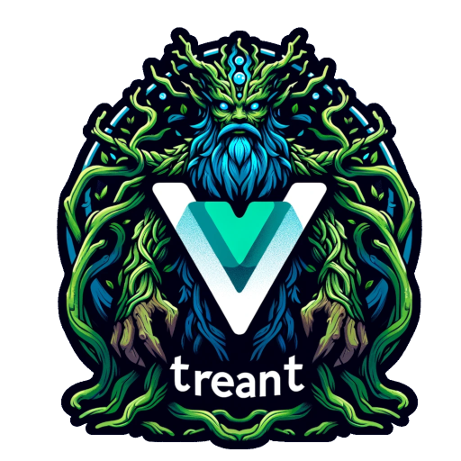

[](https://www.npmjs.com/package/vue-treant)
[](https://www.npmjs.com/package/vue-treant)
# Vue Treant

Vue Treant is a Vue 3 component designed to create and display hierarchical tree structures. It supports recursive rendering of nodes, making it perfect for visualizing entity relationships, organizational charts, or any nested data structure.
Features

* Recursive Rendering: Supports infinite levels of nesting for nodes.
* Dynamic Expansion: Nodes can be expanded or collapsed dynamically.
* Customizable: Easily customize node appearance and behavior using slots and props.
* Event Handling: Emits events for node expansion, allowing for custom behavior and state management.

## Installation

To install Vue Treant:

yarn add vue-treant

Usage

Here’s a basic example of how to use Vue Treant in your Vue 3 project.
## Basic Usage
    
Import and Register the Component
```
<script setup>
import { ref } from 'vue';
import VueTreant from 'vue-treant';

const treeData: Node[] = [{
    title: 'Root',
    id: 'root',
    children: [
        {
            title: 'Node 1',
            id: 'node_1',
            children: [
                { title: 'Node 1.1', id: 'node_1_1' },
                { title: 'Node 1.2', id: 'node_1_2', children: [{ title: 'Node 1.2.1', id: 'node_1_2_1' }] },
            ]
        },
        {
            title: 'Node 2',
            id: 'node_2',
            children: [
                { title: 'Node 2.1', id: 'node_2_1' },
                { title: 'Node 2.2', id: 'node_2_2' }
            ]
        }
    ]
},
{ title: 'Other', id: 'other' }
]
</script>

<template>
  <VueTreant :node="treeData" />
</template>
```
## Customizing Nodes


## Events

### expanded Event

*   **Event Name:** `expanded`
*   **Description:** Emitted when the expand/collapse control is clicked.
*   **Payload:** None
*   **Example:** Coming soon

### activated Event

*   **Event Name:** `on-node-activate`
*   **Description:** Emitted when the node check control is toggled.
*   **Payload:** (nodeId, isActive)
*   **Example:** @on-node-activate="handleNodeActivate" 

## Contribute

[](https://ko-fi.com/O5O8X9SD)


